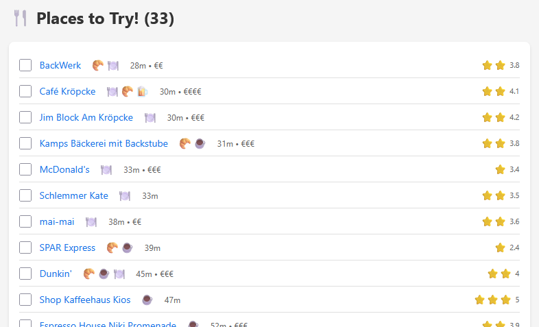
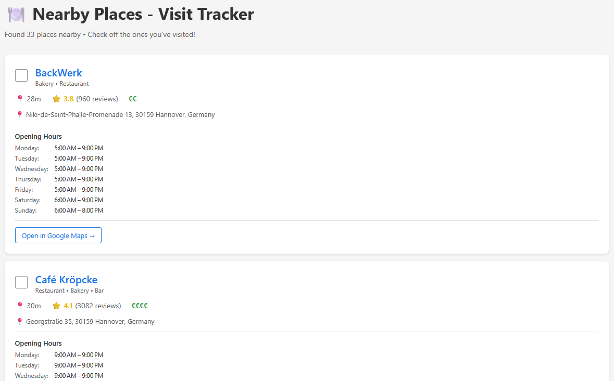
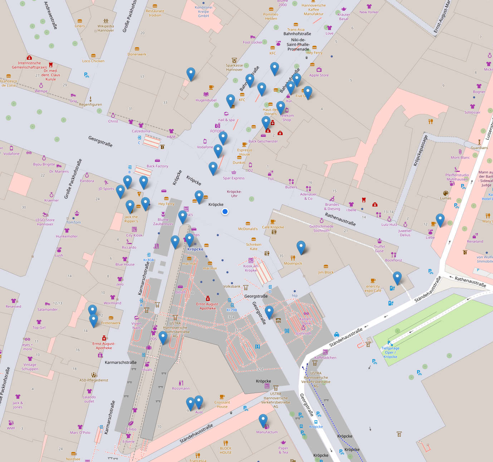

# Nearby Places

Find and explore restaurants, bars, cafes, and bakeries near any address using Google Maps API. Generate beautiful, printable lists and interactive maps.

> **Note**: Requires Google Maps API key with billing enabled. Google provides monthly free usage credits - check [current pricing and free tier limits](https://mapsplatform.google.com/pricing/#pay-as-you-go) for details.

## Features

- 🔍 Searches by address with configurable radius (default: 1000m)
- 🎯 **Smart adaptive search**: Automatically subdivides large search areas only when needed to find all places (no API limit issues)
- 📊 Fetches ratings, reviews, prices, hours, and distances
- 📋 Three visualizations:
  - **Condensed list**: One-line view with checkboxes, 3-tier ratings (⭐⭐⭐), category icons
  - **Detailed overview**: Full cards with all information
  - **Interactive map**: Leaflet.js + OpenStreetMap (free, no extra API key)
- 💾 Tracks visits with browser localStorage
- 📍 Sorts results by distance

## Preview

### Condensed List View
Perfect for printing and hanging on your fridge!



### Detailed Overview
Complete information with opening hours and reviews.



### Interactive Map
Explore places on an interactive map.



## Quick Start

**1. Install dependencies:**
```bash
npm install
```

**2. Set up API key:**
```bash
cp .env.example .env
# Edit .env and add your Google Maps API key
```

**3. Fetch places:**
```bash
npm start "Kröpcke, 30159 Hannover"
```

**4. Generate visualizations:**
```bash
npm run generate-html
# Open list.html, overview.html, or map.html in your browser
```

## Google Maps API Setup

**Quick steps:**
1. Go to [Google Cloud Console](https://console.cloud.google.com/)
2. Create new project
3. Enable billing (required - includes monthly free tier, see [pricing](https://mapsplatform.google.com/pricing/#pay-as-you-go))
4. Enable "Geocoding API" and "Places API" (or "Places API (new)")
5. Create API key under "APIs & Services" > "Credentials"
6. (Recommended) Restrict key to Geocoding + Places APIs

**API Usage:** The tool reports exact API call counts after each run. Typical usage:
- Small area (1000m): ~30-50 API calls
- Large area (2000m, no subdivision needed): ~30-60 API calls
- Large area (2000m, with adaptive subdivision): ~50-100 API calls

Breakdown: 1 geocoding call + 4-40 search calls (depending on area/subdivision) + 1 details call per place found.

Check the [pricing page](https://mapsplatform.google.com/pricing/#pay-as-you-go) for current rates and free tier limits.

📖 **Need detailed instructions?** See the [complete setup guide](GOOGLE_SETUP.md)

## Customization

Edit `fetch-places.ts` to change:
- `RADIUS_METERS`: Search radius in meters (default: 1000)
- `PLACE_TYPES`: Categories to search (default: `["restaurant", "bar", "cafe", "bakery"]`)

## Gathered Data (JSON)

Raw data is saved to `places.json` with the following structure:

```json
[
  {
    "name": "Restaurant Palios",
    "types": ["restaurant"],
    "distance_meters": 49,
    "location": {
      "lat": 52.4198123,
      "lng": 9.7986456
    },
    "rating": 4.6,
    "review_count": 1593,
    "price_level": 2,
    "opening_hours": {
      "monday": "Closed",
      "tuesday": "11:30 AM – 2:30 PM, 5:00 – 10:00 PM",
      ...
    },
    "address": "Kurze-Kamp-Straße 1, 30659 Hannover, Germany",
    "google_maps_url": "https://maps.google.com/?cid=..."
  }
]
```

Results are sorted by distance from the specified address.

## License

MIT
